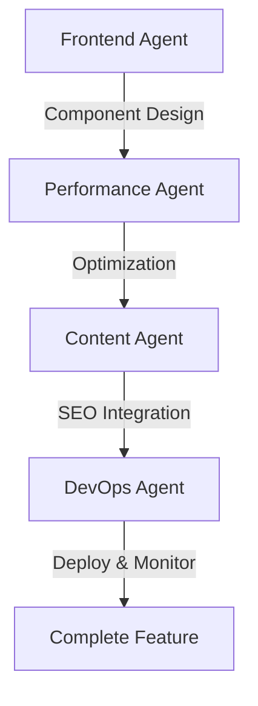
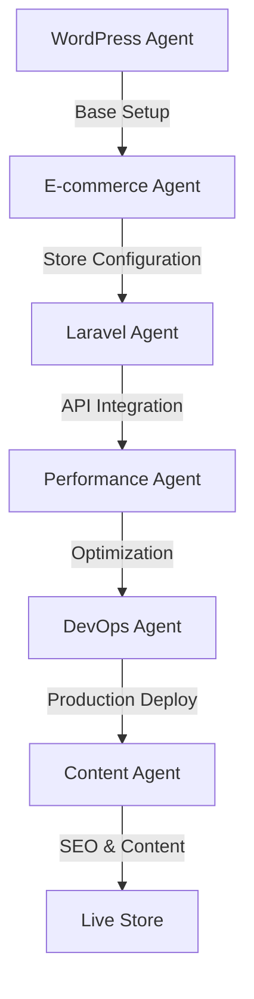

# Agents.md - Specifiche AI per Giobi.com

## 🤖 Panoramica Agenti AI

Questo file definisce le specifiche per gli agenti AI che supportano lo sviluppo, la manutenzione e l'evoluzione del progetto Giobi.com. Gli agenti sono progettati per integrarsi con GitHub Copilot e altri strumenti di automazione per massimizzare l'efficienza dello sviluppo.

## 📋 Agent Roles & Responsibilities

### 1. **Frontend Development Agent**
**ID**: `frontend-dev`  
**Scope**: Sviluppo interfacce utente e componenti frontend

**Specifiche:**
- **Linguaggi**: HTML5, CSS3, JavaScript ES6+, TypeScript
- **Framework**: Astro, React, Vue.js
- **Styling**: Tailwind CSS, SCSS, CSS Modules
- **Build Tools**: Vite, Webpack, Rollup
- **Testing**: Jest, Vitest, Cypress

**Competenze Chiave:**
```javascript
// Esempio pattern componente Astro
---
// Component frontmatter
interface Props {
  title: string;
  description?: string;
  variant?: 'primary' | 'secondary';
}

const { title, description, variant = 'primary' } = Astro.props;
---

<section class={`hero-section ${variant}`}>
  <h1 class="hero-title">{title}</h1>
  {description && <p class="hero-description">{description}</p>}
</section>

<style>
  .hero-section {
    @apply py-16 px-4 text-center;
  }
  
  .hero-title {
    @apply text-4xl md:text-6xl font-bold mb-4;
  }
  
  .hero-description {
    @apply text-lg md:text-xl text-gray-600 max-w-2xl mx-auto;
  }
</style>
```

### 2. **WordPress Development Agent**
**ID**: `wordpress-dev`  
**Scope**: Sviluppo temi, plugin e customizzazioni WordPress

**Specifiche:**
- **Linguaggi**: PHP 8.x, JavaScript, MySQL
- **Framework**: WordPress Core, ACF, WooCommerce
- **Standards**: WordPress Coding Standards, PSR-12
- **Tools**: WP-CLI, Composer, Local by Flywheel

**Competenze Chiave:**
```php
<?php
/**
 * Custom Post Type: Portfolio
 * Giobi.com Theme
 */

class Giobi_Portfolio_CPT {
    
    public function __construct() {
        add_action('init', [$this, 'register_post_type']);
        add_action('init', [$this, 'register_taxonomies']);
        add_action('add_meta_boxes', [$this, 'add_meta_boxes']);
    }
    
    public function register_post_type() {
        register_post_type('portfolio', [
            'labels' => [
                'name' => 'Portfolio',
                'singular_name' => 'Progetto Portfolio'
            ],
            'public' => true,
            'has_archive' => true,
            'supports' => ['title', 'editor', 'thumbnail', 'excerpt'],
            'show_in_rest' => true, // Gutenberg support
            'rewrite' => ['slug' => 'portfolio']
        ]);
    }
    
    public function register_taxonomies() {
        register_taxonomy('portfolio_category', 'portfolio', [
            'labels' => [
                'name' => 'Categorie Portfolio',
                'singular_name' => 'Categoria Portfolio'
            ],
            'hierarchical' => true,
            'show_in_rest' => true
        ]);
    }
}

new Giobi_Portfolio_CPT();
```

### 3. **Laravel Development Agent**
**ID**: `laravel-dev`  
**Scope**: Applicazioni backend, API e gestionali web

**Specifiche:**
- **Framework**: Laravel 10.x/11.x
- **Database**: MySQL, PostgreSQL, Redis
- **API**: RESTful, GraphQL, JSON:API
- **Testing**: PHPUnit, Pest, Feature Tests
- **Queue**: Redis, Database, SQS

**Competenze Chiave:**
```php
<?php

namespace App\Http\Controllers\Api;

use App\Http\Controllers\Controller;
use App\Http\Resources\ProjectResource;
use App\Models\Project;
use App\Http\Requests\StoreProjectRequest;
use Illuminate\Http\JsonResponse;

class ProjectController extends Controller
{
    /**
     * Display listing of projects
     */
    public function index(): JsonResponse
    {
        $projects = Project::with(['client', 'technologies'])
            ->published()
            ->latest()
            ->paginate(12);
            
        return ProjectResource::collection($projects)
            ->response()
            ->setStatusCode(200);
    }
    
    /**
     * Store new project
     */
    public function store(StoreProjectRequest $request): JsonResponse
    {
        $project = Project::create($request->validated());
        
        // Handle file uploads
        if ($request->hasFile('featured_image')) {
            $project->addMediaFromRequest('featured_image')
                ->toMediaCollection('featured');
        }
        
        return new ProjectResource($project->load('client', 'technologies'));
    }
}
```

### 4. **E-commerce Development Agent**
**ID**: `ecommerce-dev`  
**Scope**: Soluzioni e-commerce, WooCommerce, integrazioni payment

**Specifiche:**
- **Platforms**: WooCommerce, Magento, Shopify
- **Payments**: Stripe, PayPal, Satispay, Nexi
- **Integration**: ERP, CRM, Inventory systems
- **Analytics**: Google Analytics 4, Facebook Pixel

**Competenze Chiave:**
```php
<?php
/**
 * Custom WooCommerce Integration
 * Giobi.com E-commerce Solutions
 */

class Giobi_Ecommerce_Integration {
    
    public function __construct() {
        // Custom checkout fields
        add_action('woocommerce_checkout_fields', [$this, 'add_custom_checkout_fields']);
        
        // Custom payment gateway
        add_filter('woocommerce_payment_gateways', [$this, 'add_custom_gateway']);
        
        // Order sync with external ERP
        add_action('woocommerce_checkout_order_processed', [$this, 'sync_order_with_erp']);
    }
    
    public function add_custom_checkout_fields($fields) {
        $fields['billing']['billing_codice_fiscale'] = [
            'label' => 'Codice Fiscale',
            'required' => false,
            'class' => ['form-row-wide'],
            'type' => 'text'
        ];
        
        $fields['billing']['billing_partita_iva'] = [
            'label' => 'Partita IVA',
            'required' => false,
            'class' => ['form-row-wide'],
            'type' => 'text'
        ];
        
        return $fields;
    }
    
    public function sync_order_with_erp($order_id) {
        $order = wc_get_order($order_id);
        
        // API call to external ERP system
        wp_remote_post(get_option('giobi_erp_endpoint'), [
            'body' => json_encode([
                'order_id' => $order_id,
                'customer_data' => $order->get_data(),
                'items' => $order->get_items()
            ]),
            'headers' => [
                'Content-Type' => 'application/json',
                'Authorization' => 'Bearer ' . get_option('giobi_erp_token')
            ]
        ]);
    }
}

new Giobi_Ecommerce_Integration();
```

### 5. **Performance Optimization Agent**
**ID**: `performance-opt`  
**Scope**: Ottimizzazione performance, Core Web Vitals, SEO tecnico

**Specifiche:**
- **Metrics**: LCP, FID, CLS, TTFB
- **Tools**: Lighthouse, WebPageTest, GTmetrix
- **Optimization**: Image optimization, lazy loading, code splitting
- **Caching**: Redis, Varnish, CDN

**Competenze Chiave:**
```javascript
// Service Worker per PWA
class GiobiServiceWorker {
    constructor() {
        this.CACHE_NAME = 'giobi-cache-v1';
        this.urlsToCache = [
            '/',
            '/css/main.css',
            '/js/main.js',
            '/images/logo.svg'
        ];
        
        self.addEventListener('install', this.handleInstall.bind(this));
        self.addEventListener('fetch', this.handleFetch.bind(this));
    }
    
    async handleInstall(event) {
        event.waitUntil(
            caches.open(this.CACHE_NAME)
                .then(cache => cache.addAll(this.urlsToCache))
        );
    }
    
    async handleFetch(event) {
        event.respondWith(
            caches.match(event.request)
                .then(response => {
                    // Return cached version or fetch from network
                    return response || fetch(event.request);
                })
        );
    }
}

new GiobiServiceWorker();
```

### 6. **Content Management Agent**
**ID**: `content-mgmt`  
**Scope**: Gestione contenuti, SEO, traduzioni multilingua

**Specifiche:**
- **CMS**: WordPress, Strapi, Contentful
- **SEO**: Yoast, RankMath, Schema Markup
- **Multilingual**: WPML, Polylang, i18n
- **Content**: AI-generated content, copywriting

**Competenze Chiave:**
```javascript
// Multilingual content management
class GiobiContentManager {
    constructor() {
        this.languages = ['it', 'en', 'fr', 'de'];
        this.defaultLang = 'it';
    }
    
    async generateLocalizedContent(baseContent, targetLang) {
        const prompt = `
            Translate and localize the following content for ${targetLang} market:
            
            Original (Italian): ${baseContent}
            
            Requirements:
            - Maintain technical accuracy
            - Adapt cultural references
            - Preserve SEO keywords
            - Keep brand voice consistent
        `;
        
        return await this.callAIService(prompt);
    }
    
    generateSchemaMarkup(pageType, data) {
        const schemas = {
            service: {
                "@context": "https://schema.org",
                "@type": "Service",
                "name": data.name,
                "description": data.description,
                "provider": {
                    "@type": "Organization",
                    "name": "Giobi.com",
                    "url": "https://giobi.com"
                },
                "areaServed": "Milano, Italia"
            }
        };
        
        return JSON.stringify(schemas[pageType]);
    }
}
```

### 7. **DevOps & Automation Agent**
**ID**: `devops-automation`  
**Scope**: CI/CD, deployment, monitoring, backup

**Specifiche:**
- **CI/CD**: GitHub Actions, GitLab CI
- **Deployment**: Docker, Kubernetes, VPS
- **Monitoring**: New Relic, Sentry, Uptime Robot
- **Backup**: Automated database and file backups

**Competenze Chiave:**
```yaml
# GitHub Actions Workflow
name: Deploy Giobi.com

on:
  push:
    branches: [ main ]
  pull_request:
    branches: [ main ]

jobs:
  test:
    runs-on: ubuntu-latest
    steps:
    - uses: actions/checkout@v3
    
    - name: Setup Node.js
      uses: actions/setup-node@v3
      with:
        node-version: '18'
        cache: 'npm'
    
    - name: Install dependencies
      run: npm ci
    
    - name: Run tests
      run: npm test
    
    - name: Build project
      run: npm run build
    
    - name: Run Lighthouse CI
      run: |
        npm install -g @lhci/cli
        lhci autorun
  
  deploy:
    needs: test
    runs-on: ubuntu-latest
    if: github.ref == 'refs/heads/main'
    
    steps:
    - name: Deploy to production
      run: |
        # Deploy logic here
        echo "Deploying to production server"
```

## 🎯 Agent Interaction Patterns

### Collaborative Workflows

#### 1. **Feature Development Workflow**


#### 2. **E-commerce Project Workflow**


### Communication Protocols

#### Agent-to-Agent Messages
```json
{
  "from": "frontend-dev",
  "to": "performance-opt",
  "task": "component-optimization",
  "payload": {
    "component": "HeroSection",
    "metrics": {
      "lcp": "2.1s",
      "cls": "0.15"
    },
    "requirements": [
      "Reduce LCP to <1.5s",
      "Maintain visual design",
      "Preserve accessibility"
    ]
  }
}
```

## 🔧 Configuration & Setup

### Environment Variables
```bash
# AI Service Configuration
OPENAI_API_KEY=your_openai_key
GITHUB_COPILOT_TOKEN=your_copilot_token

# WordPress Integration
WP_API_URL=https://giobi.com/wp-json/wp/v2/
WP_API_KEY=your_wp_api_key

# Laravel API
LARAVEL_API_URL=https://api.giobi.com/v1/
LARAVEL_API_TOKEN=your_laravel_token

# Performance Monitoring
LIGHTHOUSE_SERVER_URL=https://lighthouse.giobi.com/
NEW_RELIC_LICENSE_KEY=your_newrelic_key

# E-commerce
WOOCOMMERCE_API_URL=https://shop.giobi.com/wp-json/wc/v3/
WOOCOMMERCE_CONSUMER_KEY=your_wc_key
WOOCOMMERCE_CONSUMER_SECRET=your_wc_secret
```

### Agent Dependencies
```json
{
  "frontend-dev": ["@astrojs/core", "tailwindcss", "typescript"],
  "wordpress-dev": ["wp-cli", "composer", "phpcs"],
  "laravel-dev": ["laravel/framework", "pest", "laravel/sanctum"],
  "ecommerce-dev": ["woocommerce", "stripe/stripe-php"],
  "performance-opt": ["lighthouse", "web-vitals", "workbox"],
  "content-mgmt": ["@wordpress/api-fetch", "yoast-seo"],
  "devops-automation": ["@actions/core", "docker", "kubernetes"]
}
```

## 📊 Success Metrics

### Key Performance Indicators (KPIs)

#### Development Efficiency
- **Code Generation Speed**: 40% reduction in development time
- **Bug Reduction**: 60% fewer bugs in production
- **Code Quality**: 90%+ test coverage
- **Documentation**: 100% auto-generated docs

#### Website Performance
- **Core Web Vitals**: All metrics in green zone
- **Page Speed**: <2s load time on mobile
- **SEO Score**: 95+ Lighthouse SEO score
- **Accessibility**: WCAG 2.1 AA compliance

#### Business Impact
- **Conversion Rate**: +25% improvement
- **User Engagement**: +40% session duration
- **Client Satisfaction**: 4.8/5 average rating
- **Project Delivery**: 99% on-time delivery

### Monitoring & Reporting
```javascript
// Agent Performance Dashboard
class AgentMetrics {
    trackAgentPerformance(agentId, taskType, duration, success) {
        const metrics = {
            agentId,
            taskType,
            duration,
            success,
            timestamp: new Date().toISOString()
        };
        
        // Send to analytics
        this.sendToAnalytics(metrics);
        
        // Update dashboard
        this.updateDashboard(agentId, metrics);
    }
    
    generateWeeklyReport() {
        return {
            totalTasks: this.getTotalTasks(),
            successRate: this.getSuccessRate(),
            avgDuration: this.getAverageDuration(),
            topPerformingAgents: this.getTopAgents(),
            improvementAreas: this.getImprovementAreas()
        };
    }
}
```

## 🚀 Future Enhancements

### Roadmap Q1-Q2 2025

#### Enhanced AI Capabilities
- **GPT-4 Integration**: Advanced code generation
- **Vision AI**: Automated design-to-code conversion
- **Natural Language**: Voice commands for development
- **Predictive Analytics**: Proactive issue detection

#### Advanced Workflows
- **Multi-Agent Coordination**: Complex project orchestration
- **Real-time Collaboration**: Live agent interaction
- **Learning System**: Continuous improvement from feedback
- **Custom Agent Training**: Domain-specific agent specialization

#### Integration Expansions
- **Figma to Code**: Automated design implementation
- **Content AI**: SEO-optimized content generation
- **Testing AI**: Comprehensive automated testing
- **Security AI**: Automated security scanning and fixes

---

## 📞 Support & Documentation

**Agent Configuration Support:**
- 📧 Email: ai-support@giobi.com
- 📚 Documentation: [docs.giobi.com/agents](https://docs.giobi.com/agents)
- 🔧 GitHub Issues: [github.com/giobi/giobicom25/issues](https://github.com/giobi/giobicom25/issues)
- 💬 Discord: Giobi Developers Community

**Training & Onboarding:**
- Agent setup workshops
- Best practices documentation
- Example projects and templates
- Community knowledge base

---

*Ultimo aggiornamento: Gennaio 2025*  
*Versione Agents Spec: 1.0.0*